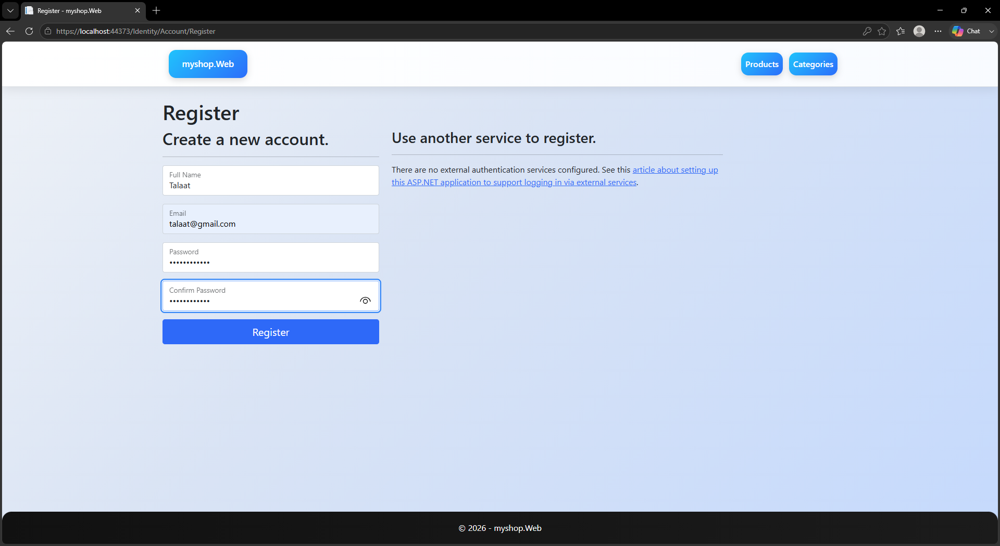
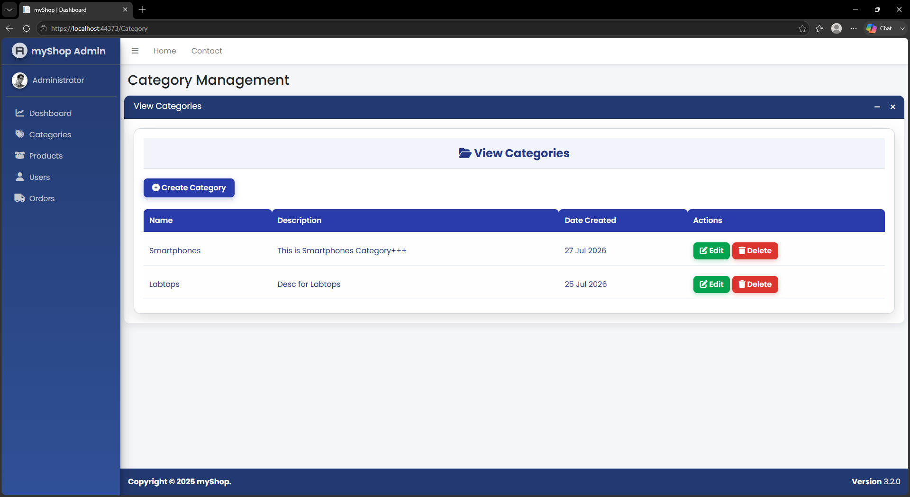
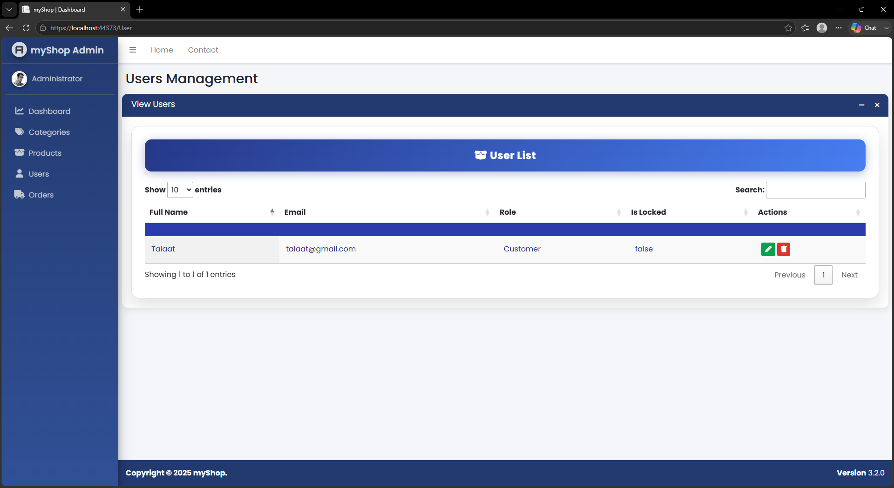

# ShopHub

A modern ASP.NET Core MVC E-Commerce application built using a **3-Tier Architecture**, **Repository Pattern**, **Unit of Work**, and **ASP.NET Core Identity**. The project is designed to demonstrate real-world backend architecture and best practices.

---

## ✨ Features

### Architecture

- 3-Tier Architecture
- Repository Pattern
- Unit of Work Pattern
- Dependency Injection
- AutoMapper
- DTO Pattern
- Entity Framework Core
- SQL Server

### Authentication & Authorization

- ASP.NET Core Identity
- Email Confirmation
- Role-Based Authorization
- Admin / Customer Roles
- User Management
- Account Lock / Unlock
- Secure Password Policies

### UI

- Bootstrap 5
- AdminLTE Dashboard
- DataTables
- SweetAlert2
- Toastr Notifications
- Font Awesome

### General

- CRUD Operations
- File Upload
- Image Management
- Entity Relationships
- Responsive Design
- Session Configuration

---

# 📦 Modules

## Category Management

- Create Category
- Edit Category
- Delete Category
- View Categories

---

## Product Management

- Create Product
- Upload Product Images
- Edit Product
- Delete Product
- View Products

---

## User Management

- View Users
- Edit User
- Change User Role
- Lock / Unlock User
- Delete User
- Role-Based Authorization

---

## Authentication

- Register
- Login
- Logout

---

# 🏗️ Project Structure

```text
ShopHub.sln

src
├── ShopHub.Web
│   ├── Controllers
│   ├── Views
│   ├── Areas
│   │   └── Identity
│   ├── wwwroot
│   └── Program.cs
│
├── ShopHub.Business
│   ├── DTOs
│   ├── Interfaces
│   ├── Services
│   ├── Mapping
│   └── DependencyInjection.cs
│
├── ShopHub.Data
│   ├── Context
│   ├── Repositories
│   ├── Seed
│   └── DependencyInjection.cs
│
└── ShopHub.Entities
    ├── Models
    └── Constants
```

---

# 🛠️ Technologies

- ASP.NET Core MVC
- Entity Framework Core
- SQL Server
- LINQ
- Bootstrap 5
- AdminLTE 3
- jQuery
- DataTables

# 🚀 Getting Started

## Clone the repository

```bash
git clone https://github.com/ixtalaat/ShopHub.git
```

## Configure the database

Update the connection string in:

```text
appsettings.json
```

## Apply migrations

```bash
dotnet ef database update
```

## Run the application

```bash
dotnet run
```

---

# 👤 Default Admin Account

After running the application, a default administrator account is seeded automatically.

> **Update these credentials to match your seeded admin account.**

| Email | Password |
|--------|----------|
| admin@shophub.com | Password123$ |

---

# 📸 Screenshots

> Replace the placeholder images below with actual screenshots after uploading them to the repository.

## Register



---

## Login


---

## Categories Management



---

## Products Management


---

## User Management



---

# 📈 Future Improvements

- Shopping Cart
- Checkout
- Orders
- Payment Integration (Stripe)
- Product Reviews
- Dashboard Analytics

---

# 📚 Learning Objectives

This project demonstrates:

- Layered Architecture
- Repository Pattern
- Unit of Work
- Dependency Injection
- Authentication & Authorization
- Role-Based Security
- Entity Framework Core
- AutoMapper
- Clean Code Practices

---

# 📄 License

This project is intended for **educational and portfolio purposes**.
